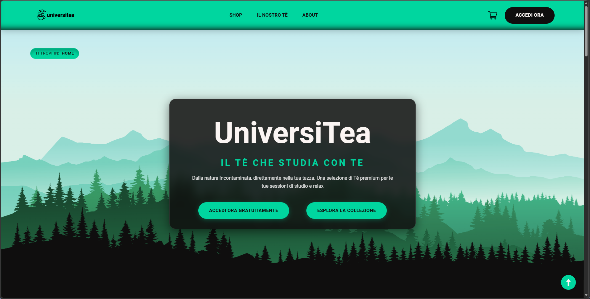
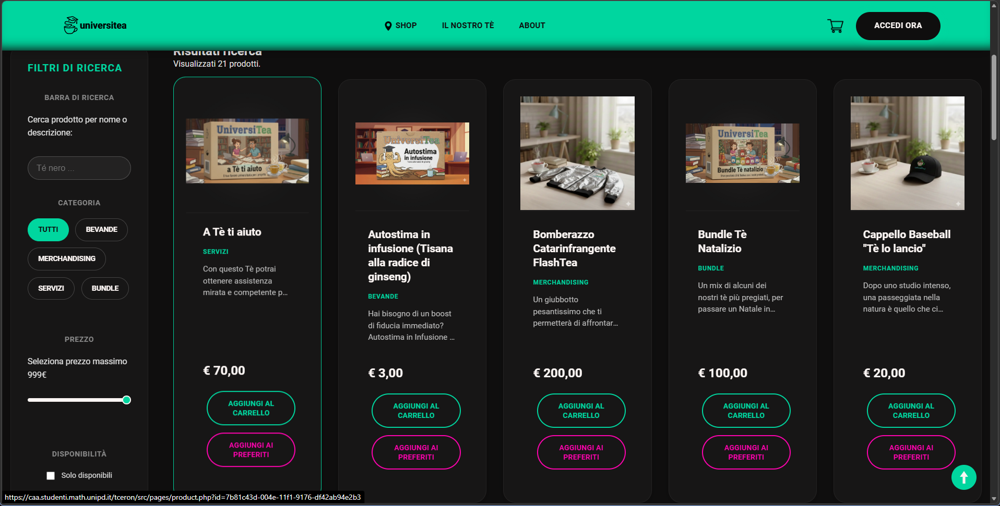
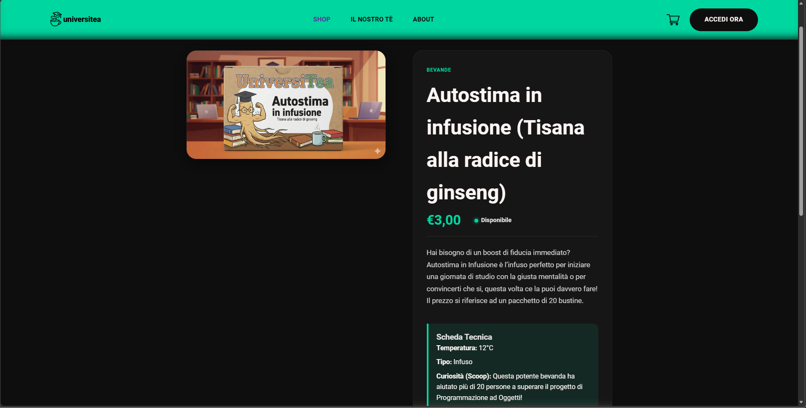

# UniversiTea
Progetto didattico del corso di Tecnologie Web, C.d.L. in Informatica, Università degli Studi di Padova.  
Il sito è accessibile al seguente [link](https://caa.studenti.math.unipd.it/tceron/index.php)

# Punti chiave
Il sito è sviluppato con attenzione all'accessibilità, ed è pertanto conforme agli standard WCAG 2.1 Level AA.  
Si tratta di un mock di un ecommerce tramite il quale è possibile registrarsi, accedere al proprio carrello e aggiungervi prodotti.
Inoltre gli utenti amministratori possono aggiungere o rimuovere i prodotti direttamente tramite un form.

# Screenshots

